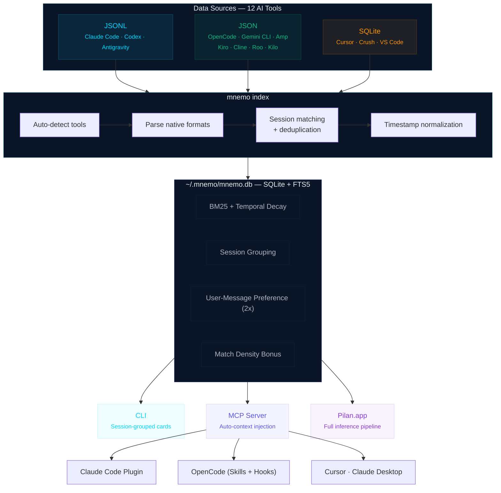

# mnemo

**Instant local search and indexing across all your AI coding sessions.**

Hi all! I'm Raghu. I'm an average Claude Code and OpenCode user. When I ran the numbers, I had 89,037 messages sitting across my AI coding tools. While organizing those chats, I realized they weren't just conversations — they were my 'decision journals'. Why I picked one architecture over another, how I debugged that weird race condition at 2am, what trade-offs I accepted and why. All of it scattered across 12 different tools in 3 different formats.

So I built mnemo. It indexes everything into one local SQLite database and gives you full-text search across all of it. No cloud, no accounts, everything stays on your machine.

## Install

```bash
# macOS / Linux
brew install Pilan-AI/tap/mnemo

# From source
go install github.com/Pilan-AI/mnemo@latest
```

## Quick start

```bash
# First run — scans your tools, indexes recent history
mnemo index

# Search across everything
mnemo search "authentication flow"

# See what you've been working on
mnemo recent --days=7

# Load context into a new session
mnemo context my-project
```

That's it. `mnemo index` auto-detects your installed tools, parses their native formats, and builds the search index. Subsequent runs are incremental.

## Supported tools

mnemo reads the native storage format of each tool directly. No exports, no copy-paste, no API keys.

| Tool | Format | What it reads |
|------|--------|---------------|
| Claude Code | JSONL | `~/.claude/projects/`, transcripts, XDG paths |
| OpenCode | JSON | `~/.local/share/opencode/` message + session dirs |
| Gemini CLI | JSON | `~/.gemini/sessions/` + new tmp/chats format |
| Cursor | SQLite | globalStorage `state.vscdb` composer data |
| Crush | SQLite | `~/.crush/crush.db` + per-project databases |
| Codex | JSONL | `~/.codex/sessions/` + archived sessions |
| Amp | JSON | `~/.local/share/amp/threads/` with usage ledger |
| Kiro | JSON | globalStorage workspace-sessions |
| Antigravity | JSONL | `~/.gemini/antigravity/code_tracker/` |
| Kilo Code | JSON | VS Code extension `tasks/ui_messages.json` |
| Cline | JSON | VS Code extension `tasks/ui_messages.json` |
| Roo Code | JSON | VS Code extension `tasks/ui_messages.json` |

## Search

mnemo search groups results by session, not by message. When you search for "liquid design," you get the 5 most relevant sessions — not 10 scattered messages that may all come from the same conversation.

```bash
# Session-grouped results with highlighted snippets
mnemo search "liquid design"

# Token-efficient format for AI context injection
mnemo search "auth flow" --context

# Full JSON for programmatic use
mnemo search "auth flow" --json
```

Results are ranked using a composite score that combines full-text relevance (BM25) with temporal decay — recent sessions naturally surface above older ones. Sessions with more matching messages score higher, and your own messages are weighted above assistant responses, since what you asked reveals more about intent than what the AI answered.

The `--context` flag produces a compact format designed for injection into AI coding sessions. Five results in ~250 tokens instead of ~2,000.

## Plugins

If you use Claude Code or OpenCode, the plugins give you a much deeper integration than raw MCP. Your AI assistant gets access to your past sessions as context — it remembers what you discussed last week.

### Claude Code plugin

```bash
mnemo install claude-code
```

This installs the [mnemo-memory plugin](https://github.com/Pilan-AI/pilan-plugins) which gives you:

- **Auto-context** — past session context loads automatically when you start working
- `/mnemo-memory:remember <query>` — search past sessions from inside Claude Code
- `/mnemo-memory:recall` — load full project memory into your current session
- **Memory agent** — a specialized subagent for deep context retrieval across projects

### OpenCode plugin

```bash
mnemo install opencode
```

Adds mnemo as an MCP tool inside OpenCode. Search and context commands available directly in your coding session.

## MCP server

For Claude Desktop, Cursor, and other MCP-compatible clients:

```bash
mnemo install
```

This configures your MCP client to launch mnemo automatically. Restart the client after installing. The MCP server exposes four tools: `mnemo_search`, `mnemo_context`, `mnemo_recent`, `mnemo_tools`.

Search results delivered through MCP use the same session-grouped ranking as the CLI but formatted for minimal token usage — your AI assistant gets maximum context in minimum space.

## Commands

| Command | What it does |
|---------|-------------|
| `mnemo index` | Index all detected AI tool sessions |
| `mnemo search <query>` | Session-grouped search with intelligent ranking |
| `mnemo recent` | Show recent sessions (default: 7 days) |
| `mnemo context <project>` | Generate project context summary |
| `mnemo status` | Show database stats and background index status |
| `mnemo tools` | List detected AI tools and session counts |
| `mnemo blocks` | Show 5-hour usage blocks with token burn rates |
| `mnemo projects` | Manage tracked project directories |
| `mnemo install` | Install plugins and MCP config |
| `mnemo add <path>` | Index a custom path |
| `mnemo version` | Print version and build info |

## How it works



1. `mnemo index` scans each tool's native storage (JSONL, SQLite, JSON)
2. Messages are normalized into `~/.mnemo/mnemo.db` — a single SQLite file with FTS5 full-text search
3. `mnemo search` groups results by session and ranks them using BM25 relevance, recency weighting, match density, and role preference
4. Results adapt to the consumer — compact cards for humans, token-efficient summaries for AI context, full JSON for programmatic access

The database is a single file. Back it up, move it between machines, query it with any SQLite client.

## Platform support

- **macOS** (Apple Silicon + Intel)
- **Linux** (arm64 + amd64)
- **Windows** (amd64)

Built with pure-Go SQLite ([modernc.org/sqlite](https://pkg.go.dev/modernc.org/sqlite)) — no CGO, no system dependencies. Single binary, runs anywhere.

## Why not grep?

grep searches text. mnemo searches **sessions**.

- grep can't parse 12 different formats (JSONL, SQLite, JSON) into meaningful conversations
- grep doesn't rank results by relevance or weight recent sessions above old ones
- grep doesn't know that a Claude Code JSONL file and a Cursor SQLite database contain the same kind of data
- grep gives you matching lines; mnemo gives you the right session with project, tool, and time context

If you use one tool and remember exact strings, grep works. If you use multiple tools and want to find "that auth discussion from last week," you need mnemo.

## What's next

mnemo is the first tool from [Pilan](https://pilan.ai). Later this month, we're launching a native macOS app that sits on top of mnemo — knowledge graph, pattern recognition, session intelligence. If mnemo is the memory, Pilan is the brain.

## Uninstall

```bash
brew uninstall mnemo
# or: rm $(which mnemo)

# Remove indexed data (optional)
rm -rf ~/.mnemo
```

## License

MIT. See [LICENSE](./LICENSE).

---

[GitHub](https://github.com/Pilan-AI/mnemo) · [X](https://x.com/Pilan_AI) · [Pilan](https://pilan.ai)

Built by 0xRaghu

[LinkedIn](https://linkedin.com/in/0xRaghu) | [X](https://x.com/Pilan_AI)

---

<div align="center">

*எண்ணென்ப ஏனை எழுத்தென்ப இவ்விரண்டும்*
*- கண்ணென்ப வாழும் உயிர்க்கு.*

Numbers and letters — these two
are the eyes of all who live.

— Thiruvalluvar, Tirukkural 392

</div>
